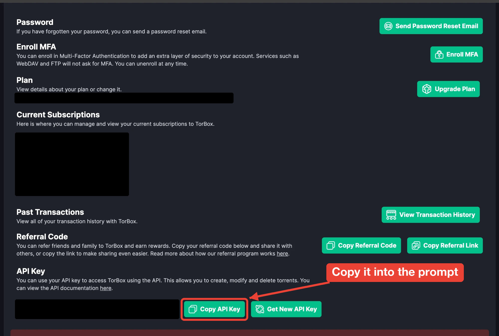

# torbox-cleaner

torbox-cleaner deletes the cloud-stored items in your
[TorBox](https://torbox.app/dashboard) account: torrents, usenet downloads, and
web downloads. It uses the [TorBox API](https://api-docs.torbox.app/). You can
delete everything at once, or delete only the items that match a size or name filter.

> [!WARNING]
> Deletion is permanent. TorBox removes each item from its download client and
> from your account. Run with `--dry-run` first to see what will be deleted.

For the full documentation, see [`docs/`](docs/). To view it locally, run
`npm install && npm run docs:dev`.

## Before you begin

You need the following:

- A TorBox account
- [uv](https://docs.astral.sh/uv/getting-started/installation/)
- Python 3.10 or later. If you don't have it, uv installs it for you.

## Run from a clone

1. Clone the repository and change to its directory:

   ```bash
   git clone https://github.com/xbmc4lyfe/torbox-cleaner.git
   cd torbox-cleaner
   ```

2. Save your TorBox API key:

   ```bash
   uv run torbox-cleaner --setup
   ```

   The setup command opens
   [your TorBox account settings](https://torbox.app/settings?section=account)
   in your browser. If it can't open a browser, it prints the link instead.

3. In the **API Key** section, click **Copy API Key**.

   

4. At the `Paste API key here:` prompt, paste your key and press **Enter**. The
   key appears as asterisks (`*`) while you type.

   torbox-cleaner checks that the key is a valid TorBox API key: a version 4
   UUID in standard canonical form, such as
   `xxxxxxxx-xxxx-4xxx-yxxx-xxxxxxxxxxxx`. If the key isn't valid, it asks you
   again. Then it saves the key as `TORBOX_API_KEY=<your key>` in the `.env`
   file at the root of the repository. If the file already has a
   `TORBOX_API_KEY`, the new key replaces it, and the other lines in the file
   stay the same.

5. Preview what would be deleted:

   ```bash
   uv run torbox-cleaner --dry-run --delete-all
   ```

6. Delete every item from your TorBox cloud:

   ```bash
   uv run torbox-cleaner --delete-all
   ```

   Before deleting anything, torbox-cleaner asks you to type `yes`.

## Install so you can run it from anywhere

1. From the root of the repository, install torbox-cleaner as a uv tool:

   ```bash
   uv tool install .
   ```

   uv puts the `torbox-cleaner` command in `~/.local/bin`. If your shell can't
   find the command, run `uv tool update-shell` and open a new terminal.

2. Save your API key:

   ```bash
   torbox-cleaner --setup
   ```

   When torbox-cleaner runs as an installed tool, it saves the key in
   `~/.config/torbox-cleaner/.env`. If `XDG_CONFIG_HOME` is set, it uses
   `$XDG_CONFIG_HOME/torbox-cleaner/.env` instead. If you skip this step,
   torbox-cleaner starts setup automatically the first time you run it.

3. Run torbox-cleaner from any directory:

   ```bash
   torbox-cleaner --delete-all
   ```

After you pull changes to the repository, run `uv tool install . --reinstall`
to update the installed command.

## Usage

| Option | Description |
| --- | --- |
| `--setup` | Open your TorBox settings, prompt for your API key, and save it. |
| `--no-browser` | With `--setup`, print the settings link instead of opening it. |
| `--delete-all` | Select every item in your account. |
| `--filter-size SIZE` | Select only items **larger than** `SIZE`, such as `50GB`, `500MB`, or `1.5TiB`. |
| `--filter-name TEXT` | Select only items whose name contains `TEXT`. Matching ignores case. You can repeat this option; an item matches if it contains any of the values. |
| `--dry-run` | List what would be deleted, without deleting anything. |
| `-y`, `--yes` | Skip the `yes` confirmation prompt. |
| `--type {torrents,usenet,webdl}` | Fetch only one type of item. You can repeat this option. The default is all three types. |
| `--env-file PATH` | Read the key from `PATH` instead of the default `.env` file. `--setup` also writes to this file. |

Unless you use `--setup`, you must use at least one of `--delete-all`,
`--filter-size`, or `--filter-name`. If you use more than one filter, an item
must match all of them.

Size units `KB`, `MB`, `GB`, and `TB` are decimal (×1000), which matches the
TorBox dashboard. `KiB`, `MiB`, `GiB`, and `TiB` are binary (×1024).

### Examples

```bash
# Delete everything larger than 50 GB
uv run torbox-cleaner --filter-size 50GB --dry-run

# Delete anything with "framestor" in its name, such as FraMeSToR or FRAMESTOR
uv run torbox-cleaner --filter-name framestor --dry-run

# Delete FraMeSToR releases larger than 50 GB, without a confirmation prompt
uv run torbox-cleaner --filter-size 50GB --filter-name framestor --yes
```

### Where torbox-cleaner looks for your key

torbox-cleaner checks these places in order and uses the first key it finds:

1. The `TORBOX_API_KEY` environment variable
2. The file passed with `--env-file`
3. `<repository>/.env`, when you run it with `uv run` from a clone
4. `~/.config/torbox-cleaner/.env`, when you run the installed command

`.env` files are listed in `.gitignore`, so your key is never committed.

## How it works

1. torbox-cleaner fetches your items with
   `GET /v1/api/{torrents,usenet,webdl}/mylist?bypass_cache=true`, 1,000 at a
   time.
2. It applies your size and name filters locally.
3. For each item that matches, it sends `POST /v1/api/torrents/controltorrent`,
   or the usenet or web download equivalent, with
   `{"<type>_id": id, "operation": "delete"}`.

Requests are sent at least 250 ms apart to stay under the TorBox limit of 300
requests per minute. If TorBox responds with HTTP 429 or a 5xx error,
torbox-cleaner waits and tries again.

Exit codes:

| Code | Meaning |
| --- | --- |
| `0` | Success, or no items matched. |
| `1` | An API error occurred, a delete failed, or you answered no at the confirmation prompt. |
| `2` | A usage error occurred, or confirmation was needed but stdin isn't a terminal. |
| `130` | You canceled setup. |

## Development

```bash
uv run pytest                     # unit tests; no network access
npm install && npm run docs:dev   # docs at http://localhost:5173
```

## GitHub Pages documentation

In the GitHub repository, set **Settings → Pages → Build and deployment →
Source** to **GitHub Actions**. The documentation workflow builds and deploys
only on pushes to `main`, including merged pull requests. It has no manual,
scheduled, or pull-request trigger. Every push to `main` rebuilds the docs.

The workflow uses the Pages base path automatically, so links and assets work
under the repository URL or a configured custom domain. Local development
continues to use `/`. To check a repository subpath locally:

```bash
DOCS_BASE=/torbox-cleaner/ npm run docs:build
```

## Source releases

Push a signed `vMAJOR.MINOR.PATCH` tag whose commit is on `main` and whose
version matches `pyproject.toml` to publish a GitHub release automatically.
The source archive contains the Python package, installation metadata and lock
file, README, GPL license, and an empty API-key example. Documentation website
sources, tests, and credentials are excluded. A SHA-256 checksum is included.

## License

GPL-2.0-only. See [LICENSE](LICENSE).
